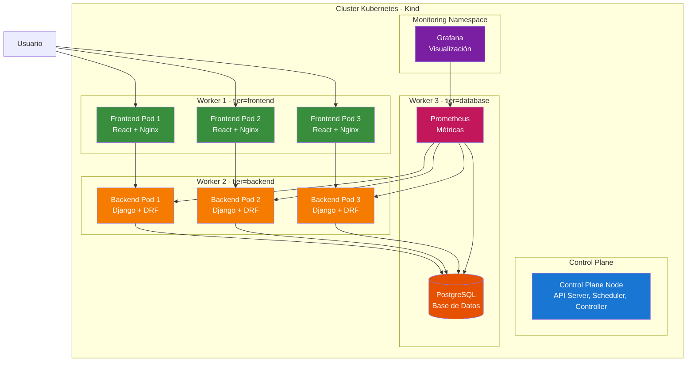

# 📚 Sistema de Librería - Kubernetes (Kind)

Sistema de gestión de biblioteca desplegado en un cluster Kubernetes multi-nodo usando **Kind** (Kubernetes in Docker), con observabilidad completa mediante **Prometheus** y **Grafana**.

---

## Arquitectura del Sistema



---

## ¿Por qué Prometheus y Grafana?

### **Prometheus** - Sistema de Monitoreo y Alertas

**Ventajas:**
- **Estándar CNCF**: Proyecto graduado de la Cloud Native Computing Foundation
- **Modelo Pull**: Scraping activo de métricas, no requiere agentes intrusivos
- **Service Discovery**: Descubre automáticamente targets en Kubernetes
- **Alta Disponibilidad**: Diseñado para entornos distribuidos

**Caso de Uso en este Proyecto:**
- Recolecta métricas del backend Django (requests, latencia, errores)
- Monitorea recursos del cluster (CPU, memoria, red)
- Detecta anomalías

### **Grafana** - Plataforma de Visualización

**Ventajas:**
- **Dashboards Interactivos**: Visualización clara y personalizable
- **Multi-datasource**: Soporta Prometheus, PostgreSQL, y más
- **Alertas Visuales**: Umbrales configurables con notificaciones
- **Open Source**: Comunidad activa con miles de dashboards prediseñados
- **Drill-down**: Análisis profundo de métricas en tiempo real

**Caso de Uso en este Proyecto:**
- Dashboard centralizado del estado del sistema
- Visualización de performance del backend Django
- Monitoreo de distribución de pods por nodo
- Análisis de tendencias y patrones de uso


## Inicio Rápido

### Prerrequisitos
```bash
# Verificar instalaciones
docker --version    # v20.10+
kind version        # v0.20+
kubectl version     # v1.27+
```

### Despliegue Automático
```bash
cd k8s/scripts/
./setup-kind.sh
```

Este script realiza:
1. Crea cluster multi-nodo (1 control-plane + 3 workers)
2. Construye imágenes Docker del backend y frontend
3. Carga imágenes en todos los nodos del cluster
4. Despliega PostgreSQL con volumen persistente
5. Despliega backend Django (3 réplicas)
6. Despliega frontend React (3 réplicas)
7. Despliega Prometheus y Grafana
8. Configura Metrics Server para HPA
9. Configura dashboard de Grafana

---

## Acceso a Servicios

| Servicio | URL | Credenciales |
|----------|-----|--------------|
| **Frontend** | http://localhost:31112 | - |
| **Backend API** | http://localhost:32532 | - |
| **Prometheus** | http://localhost:30090 | - |
| **Grafana** | http://localhost:32000 | admin / admin123 |
| **PostgreSQL** | localhost:5433 | user: admin / pass: admin123 |

---

## Comandos Esenciales

### Gestión del Sistema
```bash
# Verificar estado completo
cd k8s/scripts/
./verificar-sistema.sh

# Ver nodos del cluster
kubectl get nodes -o wide

# Ver pods por namespace
kubectl get pods -n libreria-system -o wide
kubectl get pods -n monitoring -o wide

# Ver métricas de recursos
kubectl top nodes
kubectl top pods -n libreria-system
```

### Operaciones de Backend
```bash
# Ver logs del backend
kubectl logs -f deployment/backend-deployment -n libreria-system

# Ejecutar migraciones
kubectl exec deployment/backend-deployment -n libreria-system -- python manage.py migrate

# Crear superusuario
kubectl exec -it deployment/backend-deployment -n libreria-system -- python manage.py createsuperuser

# Shell de Django
kubectl exec -it deployment/backend-deployment -n libreria-system -- python manage.py shell
```

### Escalado Manual
```bash
# Escalar backend
kubectl scale deployment backend-deployment --replicas=5 -n libreria-system

# Escalar frontend
kubectl scale deployment frontend-deployment --replicas=7 -n libreria-system

# Ver estado del HPA
kubectl get hpa -n libreria-system
```

---

## Persistencia y Volúmenes

### PostgreSQL
- **Capacidad**: 5GB
- **Path**: `/data/postgres` en worker3
- **Reclaim Policy**: Retain (los datos persisten)

### Grafana
- **Capacidad**: 2GB
- **Path**: `/data/grafana` en workers
- **Contenido**: Configuración y dashboards

### Verificación
```bash
kubectl get pv,pvc -n libreria-system
kubectl get pv,pvc -n monitoring
```

---

## Configuración de Grafana

### Reconfigurar Dashboard
```bash
cd k8s/scripts/
./configurar-grafana.sh
```

---

## Pruebas de Carga y Escalado

### Generar tráfico
```bash
# Crear pod generador de carga
kubectl run -it load-generator --rm --image=busybox --restart=Never -- /bin/sh

# Dentro del pod:
while true; do 
  wget -q -O- http://backend-service.libreria-system.svc.cluster.local:8000/api/books/
  sleep 0.1
done
```

### Observar auto-escalado
```bash
# Ver HPA
watch kubectl get hpa -n libreria-system

# Ver pods
watch kubectl get pods -n libreria-system

# Ver métricas
watch kubectl top pods -n libreria-system
```

---

## Comandos Extras

### Reiniciar componente específico
```bash
# Backend
kubectl rollout restart deployment/backend-deployment -n libreria-system

# Frontend
kubectl rollout restart deployment/frontend-deployment -n libreria-system

# Grafana
kubectl rollout restart deployment/grafana-deployment -n monitoring
```

### Cluster corrupto
```bash
# Eliminar y recrear
kind delete cluster --name libreria-cluster
cd k8s/scripts/
./setup-kind.sh
```

---
