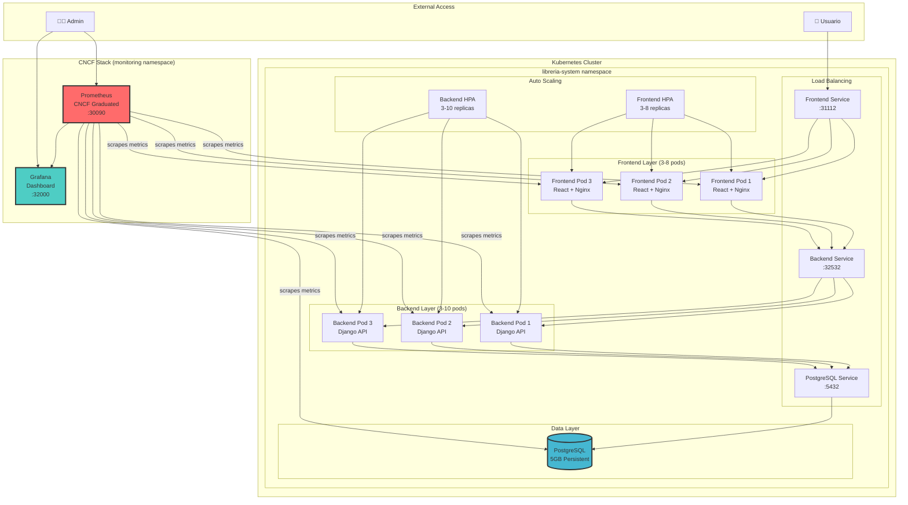

# Kubernetes + (Prometheus y Grafana) - Sistema Librería

## Resumen del Proyecto

Este configuración implementa una **migración** del Sistema Librería desde Docker Compose a **Kubernetes**, incluyendo dos **software CNCF** para monitoreo:

### **Características:**
- **Mínimo 3 instancias** de cada servicio (backend y frontend)
- **Volúmenes persistentes** para la base de datos PostgreSQL (5GB)
- **Pruebas de escalabilidad** automatizadas con HPA
- **2 Software CNCF**: Prometheus (monitoreo) + Grafana (visualización)

### URLs 
- Frontend:     http://192.168.49.2:31112
- Backend API:  http://192.168.49.2:32532  
- Prometheus:   http://192.168.49.2:30090
- Grafana:      http://192.168.49.2:32000 (admin/admin123)

### **Software CNCF:**

#### **Prometheus** (CNCF Graduated Project)
- **Versión**: v2.45.0
- **Función**: Sistema de monitoreo y alertas
- **URL**: http://$(minikube ip):30090

#### **Grafana** (Ecosistema CNCF)
- **Versión**: v10.1.0
- **Función**: Visualización de métricas y dashboards
- **URL**: http://$(minikube ip):32000
- **Credenciales**: admin / admin123

## Arquitectura Completa del Sistema

### Diagrama de Arquitectura



### **Herramientas Utilizadas**

#### **Orquestación y Contenedores:**
- **Kubernetes**: v1.34+ (Orquestador principal)
- **Minikube**: Cluster local de desarrollo
- **Docker**: Containerización de aplicaciones
- **kubectl**: Cliente CLI de Kubernetes

#### **Software CNCF:**
- **Prometheus**: v2.45.0
- **Grafana**: v10.1.0


#### **Stack de Aplicación:**
- **Backend**: Django 5.2 + Python 3.11
- **Frontend**: React 18 + Vite + TypeScript
- **Base de Datos**: PostgreSQL 15
- **Proxy**: Nginx 1.21
- **Ingress**: Nginx Ingress Controller


### **Configuraciones por Componente**

#### **Backend Django (backend.yaml)**
```yaml
# Configuración de Escalado
spec:
  replicas: 3
  
# HPA (Horizontal Pod Autoscaler)
metadata:
  name: backend-hpa
spec:
  minReplicas: 3                     # Mínimo: 3 pods
  maxReplicas: 10                    # Máximo: 10 pods
  targetCPUUtilizationPercentage: 70 
  metrics:
  - resource:
      name: memory
      target:
        type: Utilization
        averageUtilization: 80
```

#### **Frontend React (frontend.yaml)**
```yaml
# Configuración de Escalado  
spec:
  replicas: 3

metadata:
  name: frontend-hpa
spec:
  minReplicas: 3 
  maxReplicas: 8 
  targetCPUUtilizationPercentage: 60
  metrics:
  - resource:
      name: memory
      target:
        type: Utilization
        averageUtilization: 70
```

#### **PostgreSQL Database (postgres.yaml)**
```yaml
# Volumen Persistente
spec:
  capacity:
    storage: 5Gi                     # 5GB garantizados
  accessModes:
    - ReadWriteOnce                  # Un pod, lectura/escritura
  persistentVolumeReclaimPolicy: Retain
```

#### **Prometheus (monitoring/prometheus.yaml)**
```yaml
# Configuración de Scraping
global:
  scrape_interval: 15s
  evaluation_interval: 15s

# Retención de Datos
args:
  - '--storage.tsdb.retention.time=200h'

# Targets Monitoreados
scrape_configs:
  - job_name: 'kubernetes-pods'
  - job_name: 'libreria-backend'
  - job_name: 'libreria-frontend'
```

## Guía de Despliegue

### **Configuración Inicial del Cluster**

#### 1. **Iniciar Minikube**
```bash
# Iniciar con recursos personalizados
minikube start --memory=6144 --cpus=4 --disk-size=20GB

# Habilitar addons necesarios
minikube addons enable ingress
minikube addons enable metrics-server

# Verificar estado
minikube status
```

#### 2. **Configurar Docker**
```bash
# Configurar Docker para usar el registry de Minikube
eval $(minikube docker-env)
```

### **Construcción de Imágenes Docker**

#### **Backend Django**
```bash
cd backend/
docker build -t libreria-backend:latest .
docker images | grep libreria-backend
```

#### **Frontend React**
```bash
cd frontend/  
docker build -t libreria-frontend:latest .
docker images | grep libreria-frontend
```

### **Despliegue del Sistema Completo**

#### **Opción 1: Despliegue Automático**
```bash
chmod +x k8s/scripts/*.sh

# Despliegue completo: Aplicación + CNCF
cd k8s/scripts/
./setup.sh # Aplicación + Monitoreo

# Por separado
./deploy.sh # Solo la aplicación
./deploy-monitoring.sh # Solo el stack CNCF
```

#### **Opción 2: Despliegue Manual**
```bash
# 1. Crear namespaces
kubectl apply -f k8s/namespace.yaml
kubectl apply -f k8s/monitoring/namespace.yaml

# 2. Configuraciones y secretos
kubectl apply -f k8s/configmaps-secrets.yaml

# 3. Almacenamiento persistente
kubectl apply -f k8s/persistent-volumes.yaml

# 4. Base de datos
kubectl apply -f k8s/postgres.yaml

# 5. Backend con HPA
kubectl apply -f k8s/backend.yaml

# 6. Frontend con HPA  
kubectl apply -f k8s/frontend.yaml

# 7. Ingress y enrutamiento
kubectl apply -f k8s/ingress.yaml

# 8. Prometheus + Grafana
kubectl apply -f k8s/monitoring/prometheus-config.yaml
kubectl apply -f k8s/monitoring/prometheus.yaml
kubectl apply -f k8s/monitoring/grafana-config.yaml
kubectl apply -f k8s/monitoring/grafana.yaml
```

### **Verificación del Despliegue**

#### **1. Estado General del Sistema**
```bash
# Ver todos los namespaces
kubectl get namespaces

# Estado de la aplicación principal
kubectl get all -n libreria-system

# Estado del monitoreo
kubectl get all -n monitoring

# Ver todos los pods en ejecución
kubectl get pods --all-namespaces
```


## Pruebas de Escalabilidad y Rendimiento

#### **1. Escalado Manual**
```bash
# Escalar backend manualmente
kubectl scale deployment backend-deployment --replicas=6 -n libreria-system

# Escalar frontend manualmente
kubectl scale deployment frontend-deployment --replicas=5 -n libreria-system

# Verificar escalado
kubectl get pods -n libreria-system
watch 'kubectl get pods -n libreria-system'
```

#### **2. Pruebas de Carga Automatizadas**
```bash
kubectl run load-generator --image=busybox:1.35 -n libreria-system --rm -i --restart=Never -- sh -c "
  echo 'Generando 500 peticiones HTTP...'
  for i in \$(seq 1 500); do
    wget -q --timeout=2 --tries=1 http://backend-service:8000/api/books/ -O /dev/null &
    wget -q --timeout=2 --tries=1 http://frontend-service:80/ -O /dev/null &
    if [ \$((\$i % 50)) -eq 0 ]; then
      echo \"Enviadas \$i peticiones...\"
    fi
  done
  wait
  echo 'Prueba de carga completada'
"
```

#### **3. Monitoreo del Autoescalado en Tiempo Real**
```bash
# Ver HPA en tiempo real
watch 'kubectl get hpa -n libreria-system'

# Métricas de recursos en tiempo real
watch 'kubectl top pods -n libreria-system'

# Eventos de escalado
kubectl get events -n libreria-system --sort-by='.lastTimestamp' | grep -i scale
```


### **Métricas y KPIs de Rendimiento**

#### **Comandos de Monitoreo de Performance:**
```bash
# Métricas actuales de recursos
kubectl top pods -n libreria-system --sort-by=cpu
kubectl top pods -n libreria-system --sort-by=memory

# Estado del HPA con métricas detalladas
kubectl describe hpa backend-hpa -n libreria-system
kubectl describe hpa frontend-hpa -n libreria-system

# Historial de escalado
kubectl get events -n libreria-system | grep -i "scaled"
```

## Stack CNCF - Prometheus y Grafana


### **Despliegue del Stack CNCF**

#### **Despliegue Automático**
```bash
# Desplegar stack completo de monitoreo
./k8s/scripts/deploy-monitoring.sh
```

#### **Despliegue Manual**
```bash
# 1. Crear namespace de monitoreo
kubectl apply -f k8s/monitoring/namespace.yaml

# 2. Configurar Prometheus
kubectl apply -f k8s/monitoring/prometheus-config.yaml
kubectl apply -f k8s/monitoring/prometheus.yaml

# 3. Configurar Grafana
kubectl apply -f k8s/monitoring/grafana-config.yaml
kubectl apply -f k8s/monitoring/grafana.yaml

# 4. Verificar despliegue
kubectl get all -n monitoring
```

#### **Verificación del Stack CNCF**
```bash
# Estado de pods de monitoreo
kubectl get pods -n monitoring

# Servicios CNCF disponibles
kubectl get svc -n monitoring

# Logs de Prometheus
kubectl logs -f deployment/prometheus-deployment -n monitoring

# Logs de Grafana
kubectl logs -f deployment/grafana-deployment -n monitoring
```

### **Alertas Configuradas**

#### **1. High Pod CPU Usage**
```yaml
alert: HighPodCPUUsage
expr: (sum(rate(container_cpu_usage_seconds_total[5m])) by (pod) * 100) > 80
for: 5m
severity: warning
annotations:
  summary: "CPU usage crítico detectado"
  description: "Pod {{ $labels.pod }} tiene uso de CPU por encima del 80%"
```

#### **2. High Pod Memory Usage**  
```yaml
alert: HighPodMemoryUsage
expr: (container_memory_usage_bytes / container_spec_memory_limit_bytes * 100) > 80
for: 5m
severity: warning
annotations:
  summary: "Uso de memoria crítico detectado"
  description: "Pod {{ $labels.pod }} tiene uso de memoria por encima del 80%"
```

#### **3. Pod Restarting Too Much**
```yaml
alert: PodRestartingTooMuch  
expr: rate(kube_pod_container_status_restarts_total[5m]) > 0
for: 2m
severity: critical
annotations:
  summary: "Pod reiniciando frecuentemente"
  description: "Pod {{ $labels.pod }} se ha reiniciado {{ $value }} veces en 5 min"
```


### **Comandos de Gestión de Volúmenes**

#### **Verificación de Volúmenes:**
```bash
# Ver volúmenes persistentes
kubectl get pv,pvc -n libreria-system

# Detalles del volumen
kubectl describe pv postgres-pv

# Estado de la reclamación
kubectl describe pvc postgres-pvc -n libreria-system

# Uso de espacio en el pod
kubectl exec -n libreria-system deployment/postgres-deployment -- df -h
```

#### **Backup y Restauración:**
```bash
# Backup completo de la base de datos
kubectl exec -n libreria-system deployment/postgres-deployment -- \
  pg_dump -U admin libreria_db > backup_$(date +%Y%m%d_%H%M%S).sql

# Backup solo de datos (sin estructura)
kubectl exec -n libreria-system deployment/postgres-deployment -- \
  pg_dump -U admin --data-only libreria_db > data_backup.sql

# Restaurar desde backup
kubectl exec -i -n libreria-system deployment/postgres-deployment -- \
  psql -U admin libreria_db < backup.sql

# Verificar tamaño de la base de datos
kubectl exec -n libreria-system deployment/postgres-deployment -- \
  psql -U admin -d libreria_db -c "SELECT pg_size_pretty(pg_database_size('libreria_db'));"
```


## Comandos de Administración Avanzada

### **Gestión Completa de Pods**

#### **Información Detallada:**
```bash
# Ver todos los pods con información extendida
kubectl get pods -n libreria-system -o wide

# Ver recursos utilizados por pod
kubectl top pod <pod-name> -n libreria-system --containers

# Logs en vivo de todos los pods del backend
kubectl logs -f -n libreria-system -l app=backend
```


#### **Información de Red:**
```bash
# Ver configuración de Ingress
kubectl get ingress -n libreria-system -o yaml

# Estado de Ingress Controller
kubectl get pods -n ingress-nginx

# Ver reglas de enrutamiento
kubectl describe ingress -n libreria-system
```

### **Rolling Updates y Rollbacks**

#### **Actualización de Deployments:**
```bash
# Actualizar imagen del backend
kubectl set image deployment/backend-deployment backend=libreria-backend:v2 -n libreria-system
```

#### **Gestión de Rollbacks:**
```bash
# Ver historial de rollouts
kubectl rollout history deployment/backend-deployment -n libreria-system

# Rollback a versión anterior
kubectl rollout undo deployment/backend-deployment -n libreria-system

# Rollback a versión específica
kubectl rollout undo deployment/backend-deployment --to-revision=2 -n libreria-system

# Pausar rollout en curso
kubectl rollout pause deployment/backend-deployment -n libreria-system

# Resumir rollout pausado
kubectl rollout resume deployment/backend-deployment -n libreria-system
```


#### **Métricas de Sistema:**
```bash
# Uso detallado con contenedores
kubectl top pods -n libreria-system --containers=true

# Recursos disponibles en el cluster
kubectl describe nodes
```

#### **Eventos y Troubleshooting:**
```bash
# Eventos de error
kubectl get events -n libreria-system --field-selector type=Warning

# Ver eventos en tiempo real
kubectl get events -n libreria-system --watch
```


## Limpieza

```bash
# Limpieza completa 
./cleanup.sh
```
